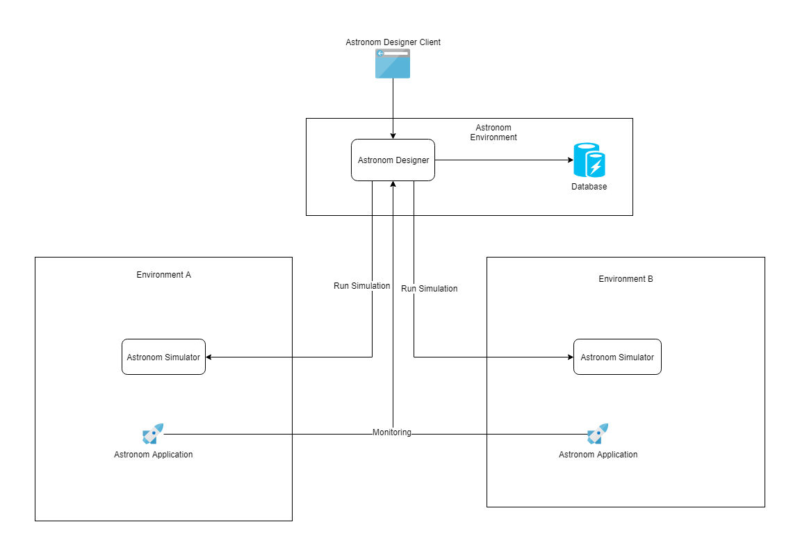

# AstronomVM 

AstronomVM is a platform that aims to provide the possibility to create, execute and deploy functional workflows.The main idea is to create workflows basing on pre-built components.

<h2>Documentation</h2>
To Do

<h2>Installation instructions</h2>
To Do

